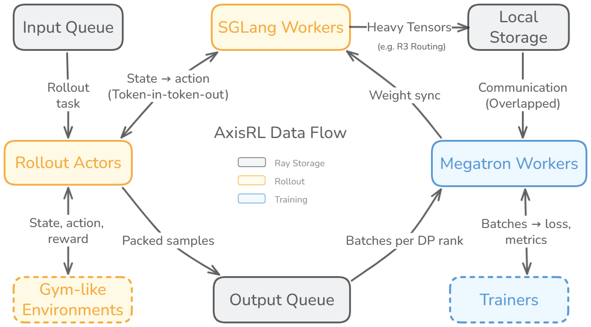
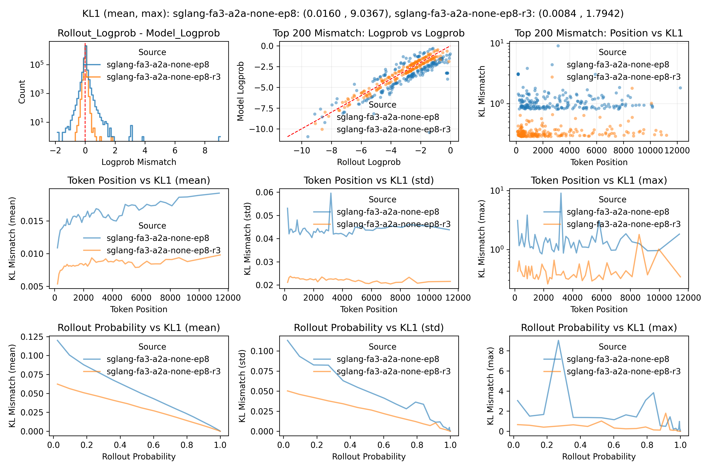

<div align="center">
  <picture>
    <source media="(prefers-color-scheme: dark)" srcset="figs/axisrl-logo-dark.svg">
    <source media="(prefers-color-scheme: light)" srcset="figs/axisrl-logo-light.svg">
    
  </picture>
</div>

<p align="center">
  <a href="../README.md">English</a>
</p>

# AxisRL

AxisRL 是一个面向 agentic RL post-training 的训练框架，构建在 SGLang rollout、Megatron training 和真实 agent workflow 之上。

AxisRL 在同一套一致的框架中连接高吞吐 rollout、大规模训练、权重同步、数据搬运、资源调度和可复现 debug。SGLang 和 Megatron 保持作为核心 serving 和 training 引擎；AxisRL 负责 agentic post-training 周围的系统层。

GitHub 仓库：[github.com/XYZ-AI-Lab/axrl](https://github.com/XYZ-AI-Lab/axrl)

## ✨ 亮点

- 基于 **SGLang** 提供高吞吐 rollout，基于 **Megatron** 提供大规模分布式训练。
- 已用于 300+ turns 的 agent RL workflow，以及数百 B 参数级别的训练场景。
- 提供可配置的 policy optimization 目标，包括 PPO、GRPO/GRPO2、GSPO、TOPR、TIS 以及相关变体。
- 同时支持 white-box agent environment，以及通过 OpenAI-compatible proxy 捕获 black-box harness。
- 通过 partial rollout 和轻量级 control plane 减少 rollout / training 的空转时间。
- 提供 handle-based data movement、context packing、routing replay、mismatch analysis 和 spike replay，以维护 rollout / trainer 一致性。

## 🧭 为什么是 AxisRL？

LLM post-training 的工作负载正在从单轮问答扩展出去。在 agentic RL 中，模型可能会和一个长时间运行的环境交互、调用工具、观察工具结果、更新上下文，并在多轮之后才获得 reward。

这改变了 post-training 框架需要承担的工作。它必须协调多轮 rollout、环境状态、tool calls、verifier、reward 收集、训练样本构造和权重同步。它也必须让训练行为可观察，因为 tokenization、chat template、logprobs、routing、packing 或 weight sync 中的细微差异，后续都可能表现为 loss spike、reward 不稳定或 rollout / trainer mismatch。

AxisRL 就是为这个场景设计的：真实 agent workflow、SGLang rollout、Megatron training，以及它们之间的系统契约。

## 🏗️ 架构



从高层看，一次 AxisRL 运行遵循这个循环：

1. Rollout actors 执行任务特定的 agent workflow。
2. SGLang workers 提供模型生成服务。
3. Environments、tools、verifiers 或外部 harness 产生交互记录和 reward。
4. Megatron workers 消费训练样本，并执行 PPO 或 GRPO-family 训练。
5. 更新后的权重同步回 rollout 侧，进入下一轮迭代。

AxisRL 保持 driver 轻量。driver 负责调度、生命周期、metrics、阶段切换和 metadata。大型 payload，例如 routing replay 数据或未来的多模态 artifact，会通过 handle-based data path 搬运，并由 trainer workers 按需读取。

## 🎯 设计目标

| 目标 | 解决的问题 | AxisRL 的思路 |
| --- | --- | --- |
| Flexibility | 不同 agent workflow 的 control flow、tools、reward、context management 和资源需求差异很大。 | 使用 recipes 承载任务逻辑，支持 white-box environment 和 black-box harness capture，并通过 resource groups 管理异构组件。 |
| Efficiency | 长尾 trajectory、tool latency、verifier 和重复上下文可能让 rollout 或 training 资源空转。 | 使用 partial rollout、轻量级 control-plane scheduling、handle-based data movement、prefix-tree merge、MagiAttention，以及 TIS、sequence masking、Icepop 等 off-policy 稳定化工具。 |
| Observability | Rollout 和 trainer 路径可能在 tokenization、masks、logprobs、routing、packing 或 weight version 上悄然偏离。 | 测试关键边界，并提供 mismatch analysis、routing replay checks 和 spike replay，用于可复现 debug。 |

## ⚙️ 安装

推荐使用项目 Docker 镜像作为运行环境。该镜像包含 SGLang、Megatron Core、MagiAttention、Ray、CUDA 依赖，以及当前 recipes 使用的 Python packages。

预构建镜像：

```bash
docker pull leejunjie/sglang-mcore:cu130-sgl0.5.14-mcore0.18-magi
```

Dockerfile：

```text
docker/cuda/cu130-sgl0.5.14-mcore0.18-magi.Dockerfile
```

如有需要，可在本地构建：

```bash
docker build \
  -f docker/cuda/cu130-sgl0.5.14-mcore0.18-magi.Dockerfile \
  -t axrl:cu130-sgl0.5.14-mcore0.18-magi \
  .
```

从仓库根目录启动容器：

```bash
docker run --gpus all --ipc=host --network=host --shm-size=64g -it \
  -v "$PWD":/workspace/axrl \
  -v "$HOME/axrl-data":/root/axrl-data \
  -w /workspace/axrl \
  leejunjie/sglang-mcore:cu130-sgl0.5.14-mcore0.18-magi \
  bash
```

在容器内安装 AxisRL：

```bash
pip install -e .
```

也可以选择下载当前 recipes 和 tests 引用的常用模型与数据集：

```bash
python axrl/example/download_data.py
```

完整下载体量可能较大，因为其中包含多 B 参数模型。对于更小范围的运行，可以调整 recipe 中的模型和数据集路径，而不是下载全部内容。

## 🚀 快速开始

下面的 recipe scripts 是主要入口。它们假设机器有足够 GPU 资源，可以承载每个 recipe 默认的并行配置。大多数配置项都可以通过命令行参数 `--path.to.field=value` 覆盖。

### GSM8K GRPO

```bash
AXRL_OUTPUT_DIR_NAME=grpo_gsm8k \
bash axis_recipe/grpo_gsm8k/run_train.sh \
  --online_rl_train.max_global_updates=4
```

### GSM8K PPO

```bash
AXRL_OUTPUT_DIR_NAME=ppo_gsm8k \
bash axis_recipe/ppo_gsm8k/run_train.sh \
  --online_rl_train.max_global_updates=4
```

### Search-R1

Search-R1 除了 rollout 和 training workers 外，还会使用 retrieval server。

```bash
export AXRL_SEARCH_PORT=18000
bash axis_recipe/search_r1/start_retriever.sh
python axis_recipe/search_r1/search_r1_config.py

AXRL_OUTPUT_DIR_NAME=search_r1 \
python -u axis_recipe/search_r1/train_search_r1.py \
  --config_path=axis_recipe/search_r1/search-r1-config.yaml \
  --online_rl_train.max_global_updates=4
```

默认完整 recipe script：

```bash
AXRL_SEARCH_PORT=18000 \
bash axis_recipe/search_r1/run_train.sh
```

### Black-Box RL With OpenHands and E2B

这个 recipe 仍在开发中。它展示了通过 OpenHands/E2B 接入 black-box harness 的路径，但 config、launch scripts 和 proxy interfaces 后续可能变化。

Black-box RL recipe 会在 E2B sandboxes 中运行 OpenHands。OpenHands 通过 OpenAI-compatible proxy 调用 AxisRL，AxisRL 捕获用于训练的模型输入、输出、metadata 和 rewards。

前置条件：

- 环境变量或 `.env` 中包含 `E2B_API_KEY`。
- 训练主机上安装 `cloudflared`，用于默认 tunnel 路径。
- 一个名为 `axrl-openhands` 的 E2B template。

首次需要构建 E2B template：

```bash
cd axis_recipe/blackbox_rl/e2b_template
e2b template build --name axrl-openhands
cd -
```

运行一个小规模 rollout smoke test：

```bash
AXRL_OUTPUT_DIR_NAME=blackbox-e2b-smoke \
AXRL_ROLLOUT_TEST_NUM_CASES=2 \
bash axis_recipe/blackbox_rl/run_rollout_test_distributed.sh
```

运行一个短训练任务：

```bash
AXRL_OUTPUT_DIR_NAME=blackbox-e2b-train \
bash axis_recipe/blackbox_rl/run_train_distributed.sh \
  --online_rl_train.max_global_updates=4
```

更多细节见 [axis_recipe/blackbox_rl/README.md](../axis_recipe/blackbox_rl/README.md)。

## 🧩 Recipes

| Recipe | 模式 | 入口 | 备注 |
| --- | --- | --- | --- |
| GSM8K GRPO | White-box RL | `axis_recipe/grpo_gsm8k/run_train.sh` | GRPO-style 数学训练 recipe。 |
| GSM8K PPO | White-box RL | `axis_recipe/ppo_gsm8k/run_train.sh` | 带 actor 和 value workers 的 PPO 数学训练 recipe。 |
| Search-R1 | White-box tool RL | `axis_recipe/search_r1/run_train.sh` | Retrieval-augmented 多轮搜索 recipe。 |
| Black-Box RL | Black-box harness RL | `axis_recipe/blackbox_rl/run_train_distributed.sh` | WIP OpenHands/E2B recipe；config 和 proxy interfaces 可能变化。 |

每个 recipe 都拥有任务特定的逻辑，例如 dataset、environment loop、verifier、reward computation、metrics 和 training configuration。共享的 AxisRL 路径负责 rollout scheduling、sample construction、trainer input、weight sync 和 debugging。

## 🔧 核心技术思路

### White-box 与 Black-box Agent Workflows

AxisRL 支持两种接入模式。

| 模式 | 适合场景 | AxisRL 负责 | 用户关注 |
| --- | --- | --- | --- |
| White-box RL | Math、Search、简单工具环境 | Agent loop control、rollout scheduling、training sample construction | Environment、tools、verifier、reward |
| Black-box RL | OpenHands、浏览器任务、复杂外部 harness | 通过 OpenAI-compatible proxy 捕获 model I/O 和 reward | Harness 启动、adapters、verifier、reward collection |

White-box recipes 在 AxisRL 内部表达 environment loop。Black-box recipes 允许已有 harness 通过 OpenAI-compatible API 调用模型，同时由 AxisRL 捕获交互并从中构造可训练样本。

### Partial Rollout

多轮 agent trajectories 往往存在长尾延迟。有些 samples 很快完成，另一些可能需要多次 tool calls 或等待较慢的 verifier responses。AxisRL 支持 partial rollout，因此已经完成或阶段性完成的 samples 可以更早交给 trainer，减少慢 trajectory 带来的等待。

### Thin Control Plane 与 Handle-Based Data Plane

大型 rollout-side payload 不应该必须经过中心化 driver。AxisRL 让 driver 聚焦于 scheduling 和 metadata，同时让重数据通过 handles 搬运。Trainer workers 按需读取 payload，这对 MoE routing replay data、复杂 rollout artifacts 和未来的多模态中间数据都很有用。

### Context Management 与 MagiAttention

Agent contexts 并不总是简单线性序列。一个 recipe 可能保留最近的 tool outputs、隐藏较早的 tool results，或用 placeholders 替换部分上下文。AxisRL 使用 prefix-tree merge 和 MagiAttention，在保留 rollout 时每一轮实际可见上下文的同时，减少重复 attention compute。

关键不变性是：context management 和 packing 不应该改变训练语义。无论一个长 trajectory 被 merge 成一个 sample，还是因为长度限制被切成多个 samples，训练侧都应该产生一致的 gradients。

### Rollout / Trainer 一致性

训练不稳定往往来自 rollout 和 trainer 执行路径之间的细微差异。AxisRL 把关键边界纳入测试，包括 tokenization、chat templates、weight sync、checkpointing、routing replay、RolloutTrace packing、prefix-tree merge、MagiAttention forward、OpenAI proxy 和 mismatch analysis。

Rollout Routing Replay (R3) 是其中一个例子。在 MoE post-training 中，R3 减少 rollout / trainer 之间的 expert routing mismatch，让 KL 和 loss 更稳定。Routing payloads 使用 handle-based data path，因此 driver 不会成为重数据中转站。



### Mismatch Analysis 与 Spike Replay

Mismatch analysis 比较 rollout 和 trainer 路径、backends、configurations 以及 routing replay 设置之间的 token-level 差异。它帮助判断问题是整体漂移、少数 outliers，还是集中在某个 token range、sequence type 或 context layout 上。

Spike replay 面向偶发的 gradient 或 loss spikes。AxisRL 可以在 spike update 前保存 weights、optimizer state、data 和相关 routing information 的 snapshot。之后可以重放同一次 update 进行检查，而不是等待下一次非确定性失败。

## 📁 仓库结构

```text
axrl/                 核心框架代码
axis_recipe/          公开 recipes 和任务特定 integrations
docs/                 设计说明、blog posts 和技术报告
docker/               用于可复现训练环境的 Dockerfiles
scripts/              运行时辅助脚本
tests/                Unit、integration 和 consistency tests
```

## ✅ 开发检查

```bash
ruff check .
pyright
```

## 📚 文档

- [English blog](axrl-blog-en.md)
- [Chinese blog](axrl-blog-cn.md)
- [Black-box RL recipe](../axis_recipe/blackbox_rl/README.md)
- [Config parsing notes](config-parsing.md)

## 🗺️ 路线图

- 添加更多真实 agent recipes 和公开 case studies。
- 改进 rollout 和 training 之间的异步执行。
- 扩展对多模态 rollout artifacts 的支持。
- 继续改进 mismatch analysis、routing replay、spike replay 和其他可复现 debug 工具。
